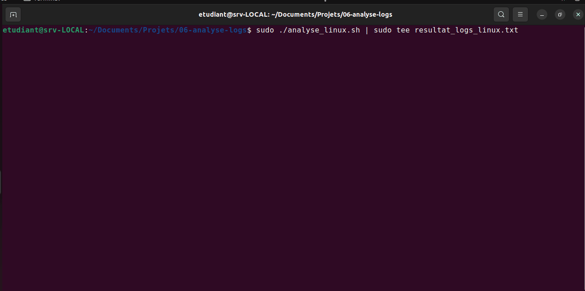

# 📑 Projet 06 – Analyseur de logs

### 📝 Description :
Extraction d’erreurs critiques des journaux système sous Linux (avec Bash) et sous Windows (avec PowerShell).

### 🖼️ Image :

### 🎞️ GIF démonstration Windows:

### 🎞️ GIF démonstration Linux:

### 🔗 Lien GitHub :
[https://github.com/tbyb/analyse-logs-sys](https://github.com/tbyb/analyse-logs-sys)

### 🛠️ Technologies utilisées :
- Bash
- PowerShell
- journalctl, grep, tail, Get-EventLog
